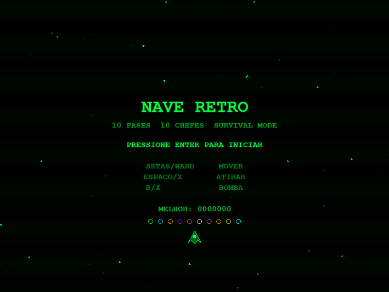

# Nave Retrô

Jogo de nave estilo shoot 'em up com visual CRT fósforo — scanlines, estrelas com parallax e efeitos retrô. Desvie e destrua asteroides e naves inimigas através de **10 setores** com chefes finais únicos.



## Funcionalidades

- **Visual CRT retrô** — fundo escuro, scanlines, efeito fósforo verde
- **Parallax de estrelas** — 3 camadas em velocidades distintas, sensação real de movimento
- **Nave com movimento livre** por toda a tela
- **10 tipos de inimigos** com comportamentos distintos:
  - Padrão, Rápido (diamante), Pesado (hexágono 3HP)
  - Zigue-zague, Bombardeiro, Varredor, Kamikaze
  - Torre (fogo rápido), Elite (duplo diamante), Destruidor (mini-chefe 4HP)
- **Asteroides** em dois tamanhos — sem disparo, puro obstáculo
- **Projéteis inimigos** com mira no jogador
- **Power-ups dropeados** por inimigos:
  - **Cristal (PWR)** — aumenta o nível do disparo até 5 (spread de 1 a 5 tiros)
  - **Bomba (BOMB)** — adiciona 1 bomba (máx. 5)
- **Bomba especial** — destroi tudo na tela com explosão visual
- **10 chefes finais únicos**, um por fase:
  - Asa-Delta, Caranguejo, Canhoneira, Dreadnought, Fantasma
  - Cristalino, Nave-Mãe, Tempestade, Titã, Soberano Final
- **10 fases com paletas distintas**: Verde → Ciano → Âmbar → Violeta → Vermelho → Branco → Rosa → Laranja → Dourado → Final
- **10 vidas** por partida + **5 continues** com tela de seleção e contagem regressiva de 10s
- **Highscore** salvo em `highscore.json`
- **Música e sons** gerados por código — sem arquivos externos

## Controles

| Tecla | Ação |
|-------|------|
| `↑ ↓ ← →` / `W A S D` | Mover a nave |
| `Espaço` / `Z` | Atirar |
| `B` / `X` | Lançar bomba |
| `Esc` | Sair |

## Sistema de Continues

Ao perder todas as 10 vidas, aparece a tela de continue com **contagem regressiva de 10 segundos**:

| Tecla | Ação |
|-------|------|
| `S` / `Enter` | Continuar da fase atual (restaura 10 vidas) |
| `N` / `R` | Recomeçar do início |
| *(sem input)* | Volta ao menu após 10 segundos |

Após esgotar os **5 continues**, o jogo exibe a tela de **Game Over** definitivo.

## Requisitos

```bash
pip install pygame
```

## Como jogar

```bash
python jogo.py
```

## Desenvolvido por

**Leandro Oliveira Moraes** — [github.com/leandroninja](https://github.com/leandroninja)
